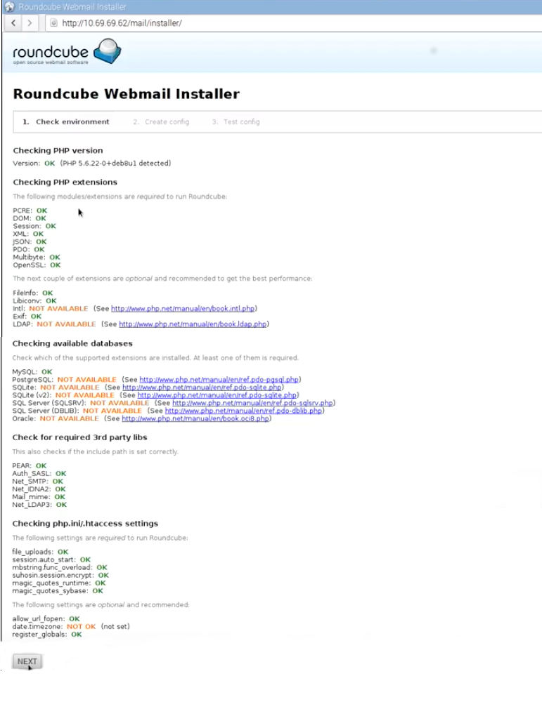

It's cool to run your own mail server. Instead of using somebody else's domain name (e.g. gmail, hotmail) and risking data mining, losing privacy, build your own low cost mail server to process your email.

## Things used in this project

#### Recommended:
- <a target="_blank" href="https://www.amazon.com/gp/search?ie=UTF8&tag=techlis05-20&linkCode=ur2&linkId=8e9b09a70535e3e8c18c6da637bf7039&camp=1789&creative=9325&index=electronics&keywords=raspberry pi">Raspberry Pi 3 Model B</a> - Pi 2 or 3 should work, the latest version may get better performance.
- <a target="_blank" href="https://www.amazon.com/gp/search?ie=UTF8&tag=techlis05-20&linkCode=ur2&linkId=90e5ecd3a209b302aecbe828e4e879b5&camp=1789&creative=9325&index=electronics&keywords=Micro SD Memory card">Micro SD Memory card</a> - At least 8GB storage to host Raspbian OS, other apps, files and emails.
- <a target="_blank" href="https://www.amazon.com/gp/search?ie=UTF8&tag=techlis05-20&linkCode=ur2&linkId=95d11834ecb832880a12d366c125635b&camp=1789&creative=9325&index=electronics&keywords=Ethernet Cord">Ethernet Cord</a> or <a target="_blank" href="https://www.amazon.com/gp/search?ie=UTF8&tag=techlis05-20&linkCode=ur2&linkId=86ef367db53fd2fa8c56774ed8f4a7be&camp=1789&creative=9325&index=electronics&keywords=Wifi dongle">Wifi dongle</a> (The Pi 3 has build-in Wifi)
- Your own domain name - this is the reason you need a custom email with the domain name of your choice. So you should own one.
#### Optional:
- <a target="_blank" href="https://www.amazon.com/gp/search?ie=UTF8&tag=techlis05-20&linkCode=ur2&linkId=f303607b9b11e1d8e7780ef78ff41987&camp=1789&creative=9325&index=electronics&keywords=Raspberry Pi Case">Raspberry Pi Case</a>
- <a target="_blank" href="https://www.amazon.com/gp/search?ie=UTF8&tag=techlis05-20&linkCode=ur2&linkId=14d846f7928fd5f610126a62e50a4647&camp=1789&creative=9325&index=electronics&keywords=USB Keyboard">USB Keyboard</a>
- <a target="_blank" href="https://www.amazon.com/gp/search?ie=UTF8&tag=techlis05-20&linkCode=ur2&linkId=43596404f85664813e50637cdd446f4b&camp=1789&creative=9325&index=electronics&keywords=USB Mouse">USB Mouse</a>

##

Below instructions assume that you have built the LAMP servesr solution already. Please do this before continuing; the instructions can be found at: [Setup LMAP server on Raspberry Pi](../raspberry-pi-lamp-server/)

This instruction is heavily base on Sam Hoobs' instructions which are more elaborate than mine, and worth visiting, as I have simplified his implementation significantly, and there are some features I did differently. Moreover, you may also check out Alex Gulyas's instructions and [this Youtube Video](https://www.youtube.com/watch?v=ACM7CmuLiXM) from Salko who is also explaining every step in detail and easy to follow.

If you follow the tutorials from start to finish, here's what you'll end up with:

1. An email server (and web server) that you can run 24/7/365 for under $10 of electricity per year
2. Personalized email address like you@yourdomain.com
3. The ability to connect from anywhere to check and response email, using secure IMAP connection on your mobile devices, or web browsers.
4. Complete control over your personal communication.
5. Proud yourself to create something useful and learn new stuff

##

Mail servers are very popular for hackers who want to hijack it to send out spam in your name, so it's rather important that you change your password to something other than raspberry.
```
sudo passwd pi
```

## Implement Postfix and Dovecot
```
sudo apt-get update
sudo apt-get install postfix
sudo apt-get install dovecot-common dovecot-imapd
```
Select '**Internet Site**' and then set the mail name to your domain name. In this article, I refer to the domain name as **example.com**
```
cd /etc/postfix/
sudo nano /etc/postfix/main.cf
```

Edit the following:

```
myhostname = example.com
```

Add the following:

```
inet_protocols = ipv4
home_mailbox = Maildir/
mailbox_command =
smtpd_recipient_restrictions =
       permit_sasl_authenticated,
       permit_mynetworks,
       reject_unauth_destination
smtpd_helo_required = yes
smtpd_helo_restrictions =
       permit_mynetworks,
       permit_sasl_authenticated,
       reject_invalid_helo_hostname,
       reject_non_fqdn_helo_hostname,
       reject_unknown_helo_hostname,
       check_helo_access hash:/etc/postfix/helo_access
smtpd_sasl_type = dovecot
smtpd_sasl_path = private/auth
smtpd_sasl_auth_enable = yes
smtpd_tls_auth_only = yes
milter_protocol = 2
milter_default_action = accept
smtpd_milters = inet:localhost:12301
```

Ctrl-X to exit, and Y to save.

```
sudo maildirmake.dovecot /etc/skel/Maildir
sudo maildirmake.dovecot /etc/skel/Maildir/.Drafts
sudo maildirmake.dovecot /etc/skel/Maildir/.Sent
sudo maildirmake.dovecot /etc/skel/Maildir/.Spam
sudo maildirmake.dovecot /etc/skel/Maildir/.Trash
sudo maildirmake.dovecot /etc/skel/Maildir/.Templates
sudo maildirmake.dovecot /etc/skel/Maildir/.Junk
sudo cp -r /etc/skel/Maildir /home/pi/
sudo chown -R pi:pi /home/pi/Maildir
sudo chmod -R 700 /home/pi/Maildir
sudo nano /etc/postfix/helo_access
```

Add the following:

```
example.com          REJECT          Email rejected - cannot verify identity
mail.example.com      REJECT          Email rejected - cannot verify identity
```

Ctrl-X to exit, and Y to save.

```
sudo postmap /etc/postfix/helo_access
sudo nano /etc/dovecot/dovecot.conf
```

Edit:

```
listen = *
```

Ctrl-X to exit, and Y to save.

```
sudo nano /etc/dovecot/conf.d/10-mail.conf
```

Edit:

```
mail_location = maildir:~/Maildir
```

Ctrl-X to exit, and Y to save.

```
sudo nano /etc/dovecot/conf.d/10-master.conf
```

Edit:

```
service imap-login {
 inet_listener imap {
   port = 143
 }
 inet_listener imaps {
   port = 993
   ssl = yes
 }
}
service auth {
       unix_listener /var/spool/postfix/private/auth {
               mode = 0660
               user = postfix
               group = postfix
       }
}
```

Ctrl-X to exit, and Y to save.

```
sudo nano /etc/dovecot/conf.d/10-auth.conf
```

Edit:

```
disable_plaintext_auth = no
auth_mechanisms = plain login
```

Ctrl-X to exit, and Y to save.

```
sudo nano /etc/dovecot/conf.d/10-ssl.conf
```

Edit:

```
ssl = yes
ssl_protocols = !SSLv3
ssl_cert = </etc/letsencrypt/live/example.com/fullchain.pem 
ssl_key = </etc/letsencrypt/live/example.com/privkey.pem 
```

You will note that rather than building a new SSL certificate, we are leveraging the certificate from Let's Encrypt that was already previously built.

Ctrl-X to exit, and Y to save. Now you will need to use the below "adduser" command to add each email address that you wish to set up. For example, to set up [joedoe@example.com:](http://joedoe@example.com/)

```
sudo adduser joedoe
```

Open this file:
```
sudo nano /etc/postfix/master.cf
```

Add:
```
 -o content_filter=spamassassin
```

Bellow this line:
```
smtp      inet  n       -       y       -       -       smtpd
```

Add:
```
 -o syslog_name=postfix/smtps
 -o smtpd_tls_wrappermode=yes
 -o smtpd_recipient_restrictions=permit_sasl_authenticated,reject
```

Bellow this line:
```
smtps     inet  n       -       -       -       -       smtpd
```

So it will look something like this:
```
...
smtp      inet  n       -       y       -       -       smtpd
        -o content_filter=spamassassin
#smtp      inet  n       -       y       -       1       postscreen
#smtpd     pass  -       -       y       -       -       smtpd
...
smtps     inet  n       -       -       -       -       smtpd
  -o syslog_name=postfix/smtps
  -o smtpd_tls_wrappermode=yes
  -o smtpd_recipient_restrictions=permit_sasl_authenticated,reject
```

Add this to the end of the file:
```
spamassassin    unix  -       n       n       -       -       pipe user=debian-spamd argv=/usr/bin/spamc -f -e /usr/sbin/sendmail -oi -f ${sender} ${recipient}
```

Ctrl-X to exit, and Y to save.

### Add DKIM to stop your emails from being treated as spam

```
sudo apt-get install opendkim opendkim-tools
sudo nano /etc/opendkim.conf
```

Add or edit (if exist) as below:

```
AutoRestart             Yes
AutoRestartRate         10/1h
SyslogSuccess           Yes
LogWhy                  Yes
Canonicalization        relaxed/simple
ExternalIgnoreList      refile:/etc/opendkim/TrustedHosts
InternalHosts           refile:/etc/opendkim/TrustedHosts
KeyTable                refile:/etc/opendkim/KeyTable
SigningTable            refile:/etc/opendkim/SigningTable
Mode                    sv
PidFile                 /var/run/opendkim/opendkim.pid
SignatureAlgorithm      rsa-sha256
UserID                  opendkim:opendkim
Socket                  inet:12301@localhost
```

Ctrl-X to exit, and Y to save.

```
sudo nano /etc/default/opendkim
```

Edit:

```
SOCKET="inet:12301@localhost"
```

Ctrl-X to exit, and Y to save.

```
sudo mkdir /etc/opendkim
sudo mkdir /etc/opendkim/keys
sudo nano /etc/opendkim/TrustedHosts
```

Add:
```
127.0.0.1
localhost
192.168.0.1/24
*.example.com
```
Also add your pi's local ip address in there. You can find it by this command: ```hostname -I```

Ctrl-X to exit, and Y to save.

```
sudo nano /etc/opendkim/KeyTable
```

Add:

```
mail._domainkey.example.com example.com:mail:/etc/opendkim/keys/example.com/mail.private
```

Ctrl-X to exit, and Y to save.

```
sudo nano /etc/opendkim/SigningTable
```

Add:

```
*@example.com mail._domainkey.example.com
```

Ctrl-X to exit, and Y to save.

```
cd /etc/opendkim/keys
sudo mkdir example.com
cd example.com
sudo opendkim-genkey -s mail -d example.com
sudo chown opendkim:opendkim mail.private
sudo chmod 777 mail.txt
sudo nano -$ mail.txt
```

Go to your domain registrar (e.g., CloudFlare, EuroDNS, GoDaddy, etc.). Use this output to set up a TXT record, with hostname: mail._domainkey and with value: v=DKIM1; k=rsa; p=MIG....
```
sudo service dovecot reload
sudo service dovecot restart
sudo service postfix reload
sudo service postfix restart
sudo service opendkim restart
```

### Identify incoming spam email with SpamAssassin

```
sudo apt-get install spamassassin
sudo nano /etc/spamassassin/local.cf
```

Edit:

```
rewrite_header Subject [***** SPAM _SCORE_ *****]
report_safe 0
required_score 5.0
use_bayes 1
```

Ctrl-X to exit, and Y to save.

```
sudo nano /etc/default/spamassassin
```

Edit:

```
ENABLED=1
```

Ctrl-X to exit, and Y to save.

```
sudo service spamassassin start
sudo systemctl enable spamassassin
sudo service dovecot restart
sudo service postfix restart
```

### Install Web-base Email Client: RoundCube

There are few other webclients such as SquirrelMail, or RainLoop which are also excellent choices, but I refer RoundCube as it's compatible, easy to install, and graphically pleasing to the eye. Research them and choose the webclient that you like, but I will use RoundCude for now.

install wget if you don't have it

```
sudo apt-get install wget
```

We can download [latest RoundCude version here](https://roundcube.net/download/)
Copy link address of the complete latest stable version, then use wget to download.
unzip it into ```/var/www/html``` folder and rename to ```mail```. For example:

```
cd /var/www/html
sudo wget https://github.com/roundcube/roundcubemail/releases/download/1.3.6/roundcubemail-1.3.6-complete.tar.gz
sudo tar xvf roundcubemail-1.3.6-complete.tar.gz
sudo mv roundcubemail-1.3.6 mail
sudo rm roundcubemail-1.3.6-complete.tar.gz
```

Now we need to setup database for RoundCube. Choose your secured password

```
sudo mysql -u root -p
CREATE DATABASE roundcubemail;
GRANT ALL PRIVILEGES ON roundcubemail.* TO roundcube@localhost IDENTIFIED BY 'secretpassword';
FLUSH PRIVILEGES;
quit
```

Install RoundCube by enter to your web browser: ```http://local_ip_address/mail/installer/```

If Your screen look something like this, it should be fine as we don't need all of them



In next screen, you can change product_name. Check your Database setup and enter the password you set earlier. We can keep the rest as default settings.
Click "CREATE CONFIG" button to continue.
- Then follow the instruction to create an empty file name **config.inc.php** within the **/var/www/html/mail/config/** directory.
- Copy everything from the block and paste it into the file.
- Change the last line of that file to:
```
$config['plugins'] = array('managesieve');
```

This will add **filters** section to roundcube webmail's settings so that we can use more features such as email forwarding, etc.

Next, click button "continue". In next screen if temp and logs folder is **NOT OK** We need to change ownership
```
chown www-data:www-data logs
chown www-data:www-data temp
chmod 755 logs
chmod 755 temp
```
Then they should be green. Click button "Initialize Database". After completing the installation and the final tests please **remove** the whole installer folder from the document root of the webserver.

Now your webmail should work at:```http://local_ip_address/mail```

### Training Spamassassin

Create a simple cron job to train SpamAssassin daily.

```
sudo nano /etc/cron.daily/spamassassin-learn
```
Now copy and paste this into the file
```
#!/bin/bash

# redirect errors and output to logfile
exec 2>&1 >> /var/log/spamassassin.log
 
NOW=$(date +"%Y-%m-%d")
 
# Headers for log
echo ""
echo "#============== $NOW ==============#"
echo ""
 
# learn HAM
echo "Learning HAM from Inbox"
sa-learn --dbpath /var/lib/spamassassin/.spamassassin/ --no-sync --ham /home/*/Maildir/{cur,new}
 
# learn SPAM
echo "Learning SPAM from Spam folder"
sa-learn --dbpath /var/lib/spamassassin/.spamassassin/ --no-sync --spam /home/*/Maildir/.Spam/{cur,new}
 
# Synchronize the journal and databases.
echo "Syncing"
sa-learn --dbpath /var/lib/spamassassin/.spamassassin/ --sync
```
**Important:** The paths use glob (*) to scan ham and spam for all users (this only works if you trust all users to be sensible and move ham/spam to the right folder). It may affect your pi's performance. If you want to run on your username only, edit the paths so that they match your username!

Now make the script executable:
```
sudo chmod +x /etc/cron.daily/spamassassin-learn
```

### Spam Sorting with LMTP & Sieve

```
sudo apt-get install dovecot-lmtpd
```
Edit ```/etc/dovecot/dovecot.conf```
Append this to enable lmtp:
```
protocols = imap lmtp
```
Edit ```/etc/dovecot/conf.d/20-lmtp.conf```
Add this line:
```
lmtp_save_to_detail_mailbox = yes
```
Now change the lmtp protocol block to look like this:
```
protocol lmtp {
  mail_plugins = $mail_plugins sieve
  postmaster_address = postmaster@yourdomain.com
}
```
Edit file ```/etc/dovecot/conf.d/10-master.conf```
Now find the service lmtp {… block and then change the line unix_listener lmtp {… to look like this:
```
service lmtp {
  unix_listener /var/spool/postfix/private/dovecot-lmtp {
    mode = 0666
  }
}
```
**Carefull** with the open and close bracket { }

Edit file ```/etc/dovecot/conf.d/10-auth.conf``` and change:
```
auth_username_format = %Ln
```
Edit ```/etc/postfix/main.cf```
Comment out:
```
mailbox_command=
```
…and add:
```
mailbox_transport = lmtp:unix:private/dovecot-lmtp
```
#### Sieve Rules
Dovecot's sieve is already installed, you can check by running:
```
sudo apt-get install dovecot-sieve
```
Now we need to change one more parameter in ```/etc/dovecot/conf.d/90-sieve.conf```

Uncomment this line:
```
recipient_delimiter = +
```
We still need to reload/restart Postfix and Dovecot to make that all the changes are loaded:
```
sudo service postfix reload
sudo service dovecot reload
```
The default place to put the sieve script is in the user's home folder: ```~/.dovecot.sieve```.

**Note:** You may need to repeat steps below for every user by replacing **user** in path for each username.

Create it like this:
```
sudo nano /home/user/.dovecot.sieve
```
and add this:
```
require ["fileinto"];
# Move spam to spam folder
if header :contains "X-Spam-Flag" "YES" {
  fileinto "Spam";
  # Stop here - if there are other rules, ignore them for spam messages
  stop;
}
```
Now chown the file to the owner of the mailbox, e.g.:
```
sudo chown user:user /home/user/.dovecot.sieve
```

### Managesieve

```
sudo apt-get install dovecot-managesieved
```
open ```/etc/dovecot/dovecot.conf``` and add sieve to the protocols line:
```
protocols = imap lmtp sieve
```
and restart Dovecot:
```
sudo service dovecot restart
```
### Port forwarding

Finally, you must forward all the used ports for this implementation to your Raspberry Pi on your router:
- Mail Server: 443
- SMTP Server: 25
- IMAPS Server: 993
- SSMTP Legacy: 465
- Managesieve: 4190
- DKIM: 12301
- And possibly 110, 143, and 995

**Viola!!!** If everything is setup right you should have a fully functioned email server at low cost. Enjoy your custom email!