In previous post, I wrote how to install LAMP and mail servers on Raspberry Pi. While mail server is performing well on my Raspberry Pi 3, I'm still thinking that it may be capable of handling an extra Pi-Hole server. And I was right. Both mail and Pi-Hole server can work well in one Pi. Let give it a shot, it saves you an extra Pi and some energy consumption. Result of cost efficiency!

So what is Pi-Hole? It's a black hole for internet advertisements. A network-wide ad blocker works by acting as your DNS server. What the network-wide ad blocker does is act as your DNS server. Your computers our routers will connect to it for DNS requests.

These DNS requests will then be filtered by the Raspberry Pi. Any DNS requests that match any that match a known ad host will be rejected meaning the connection will never meet your computer. Therefore the ad will never be loaded by the devices.

## Things used in this project

#### Recommended:

- <a target="_blank" href="https://www.amazon.com/gp/search?ie=UTF8&tag=techlis05-20&linkCode=ur2&linkId=8e9b09a70535e3e8c18c6da637bf7039&camp=1789&creative=9325&index=electronics&keywords=raspberry pi">Raspberry Pi 3 Model B</a> - Pi 2 or 3 should work, the latest version may get better performance.
- <a target="_blank" href="https://www.amazon.com/gp/search?ie=UTF8&tag=techlis05-20&linkCode=ur2&linkId=90e5ecd3a209b302aecbe828e4e879b5&camp=1789&creative=9325&index=electronics&keywords=Micro SD Memory card">Micro SD Memory card</a> - At least 8GB storage to host Raspbian OS, other apps, files and emails.
- <a target="_blank" href="https://www.amazon.com/gp/search?ie=UTF8&tag=techlis05-20&linkCode=ur2&linkId=95d11834ecb832880a12d366c125635b&camp=1789&creative=9325&index=electronics&keywords=Ethernet Cord">Ethernet Cord</a> or <a target="_blank" href="https://www.amazon.com/gp/search?ie=UTF8&tag=techlis05-20&linkCode=ur2&linkId=86ef367db53fd2fa8c56774ed8f4a7be&camp=1789&creative=9325&index=electronics&keywords=Wifi dongle">Wifi dongle</a> (The Pi 3 has build-in Wifi)


#### Optional:

- <a target="_blank" href="https://www.amazon.com/gp/search?ie=UTF8&tag=techlis05-20&linkCode=ur2&linkId=f303607b9b11e1d8e7780ef78ff41987&camp=1789&creative=9325&index=electronics&keywords=Raspberry Pi Case">Raspberry Pi Case</a>
- <a target="_blank" href="https://www.amazon.com/gp/search?ie=UTF8&tag=techlis05-20&linkCode=ur2&linkId=14d846f7928fd5f610126a62e50a4647&camp=1789&creative=9325&index=electronics&keywords=USB Keyboard">USB Keyboard</a>
- <a target="_blank" href="https://www.amazon.com/gp/search?ie=UTF8&tag=techlis05-20&linkCode=ur2&linkId=43596404f85664813e50637cdd446f4b&camp=1789&creative=9325&index=electronics&keywords=USB Mouse">USB Mouse</a>
- Your own domain name (etc. example.com)


## Installing Pi-Hole to your Raspberry Pi

First of all, you need a static IP for your Pi. This should has been addressed if you followed my previous posts. Otherwise, try this

```
$ cat << | sudo tee -a /etc/network/interfaces.d/eth0 
auto eth0
iface eth0 inet static
  address 192.168.1.253
  netmask 255.255.255.0
  gateway 192.168.1.1
EOF
```

You can choose any static IP for your Pi. Then upgrade installed packages:

```
sudo apt-get update && apt-get upgrade -y
```

Installing Pi-Hole is pretty easy by running this command on your Pi

```
curl -sSL https://install.pi-hole.net | bash
```

Then all steps should be automatically until you see few GUIs, just go through most of them by default

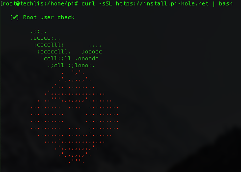

Just select **ok** for these screens

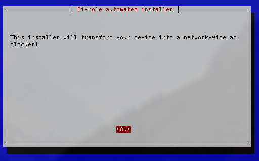
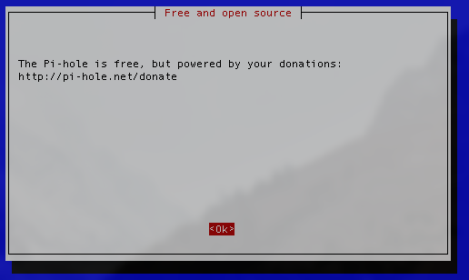
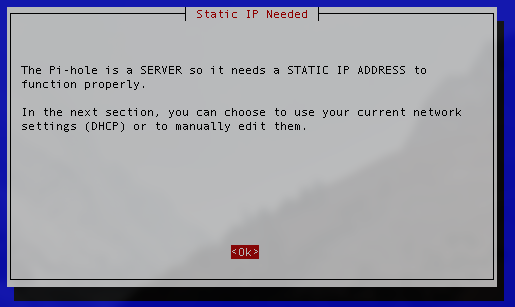
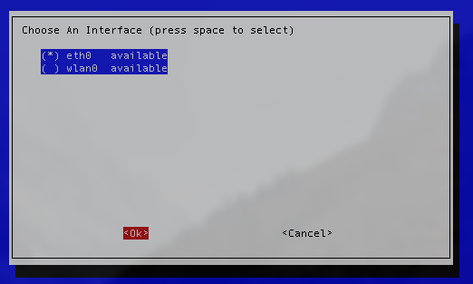

Base on my testing OpenDNS gave the fastest response, but Google is also the most reliable DNS provider. Pick either of them.
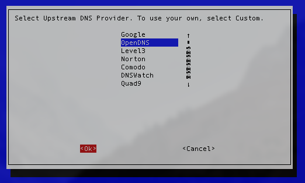

Then keep going through these screen with default setting
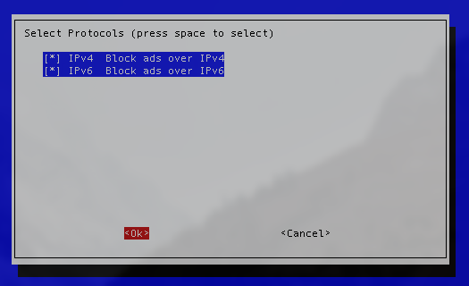
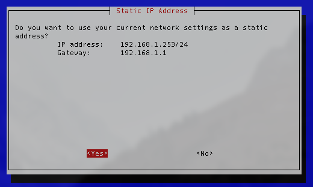
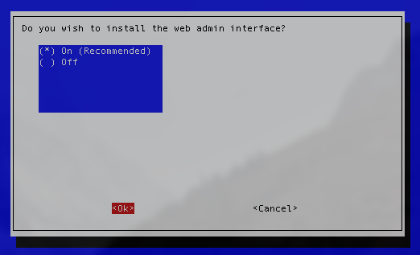
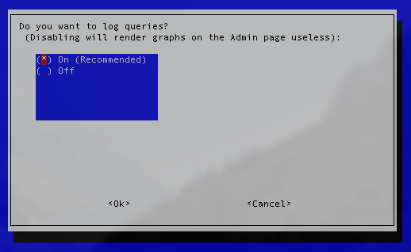
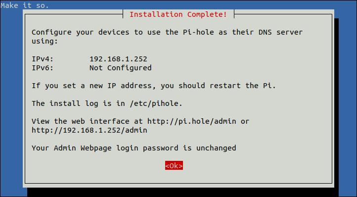

Change admin password using Terminal.

```
pihole -a -p
```

## Connecting your Network to the Raspberry Pi Pi-hole

There are two different methods for setting up the network-wide ad-blocker on your network.

### Option 1: Setting Routers DNS Settings

This is the easiest option and will extend the coverage of the network-wide ad-blocker to all your devices by changing your router’s DNS settings to point towards the Raspberry Pi. I highly recommend this option.

Go to your router Admin page, look for **DNS Server**, or **DHCP Server** set the primary DNS server to the IP address of your Raspberry Pi, for instance, mine is 192.168.1.253.

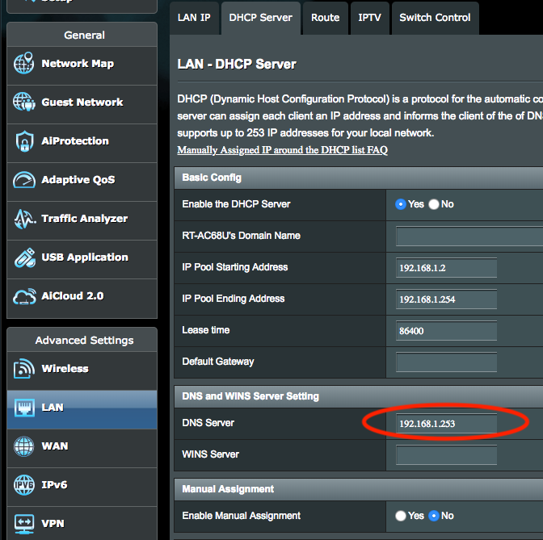

### Option2: Setting individual Devices DNS settings

This is more difficult to setup and something you must do every time you add a new device to your network, but is perfect if you want to set it per device rather than setting it on your router.
Basically, you need to manually modify the DNS settings of your device to use the Pi's ip address, for instance, mine is 192.168.1.253.

## A Quick Look into the Pi-hole Web Interface

When all is done, you may be able to see Pi-hole web interface (if not restart your Pi)

```
http://192.168.1.253/admin/
```
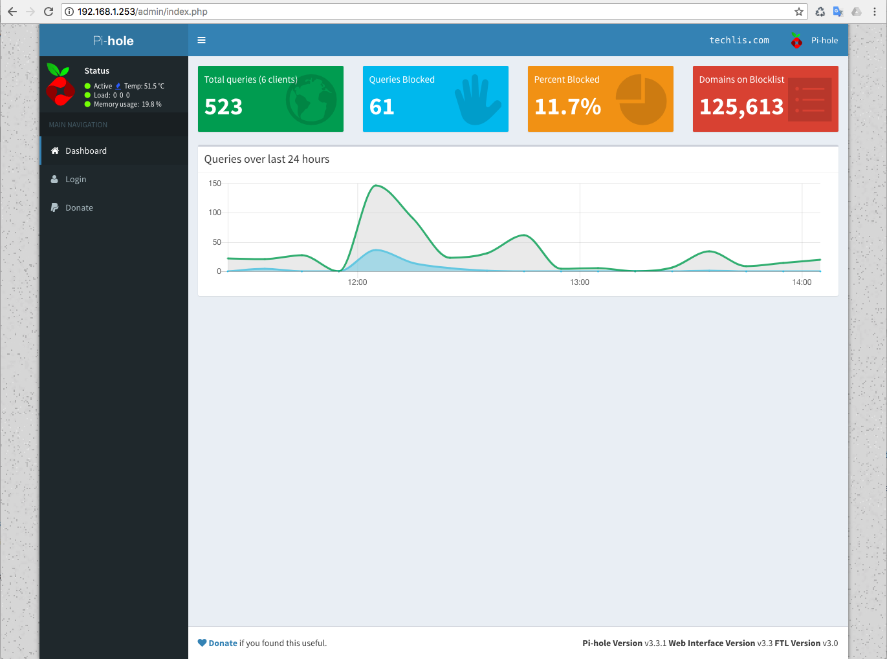

You can also login using the new changed password in early step to see more detail and setting.

## Testing if Pi-hole is working

The quick way to test if Pi-hole is working is accessing this site on your device
[http://pi.hole/admin/](http://pi.hole/admin/)

If you can access the Web interface on your device then it's working. Or testing with this link:
[https://blockads.fivefilters.org/?pihole](https://blockads.fivefilters.org/?pihole)

That's it! Quick and easy. Enjoy ad blocking for your entire network!